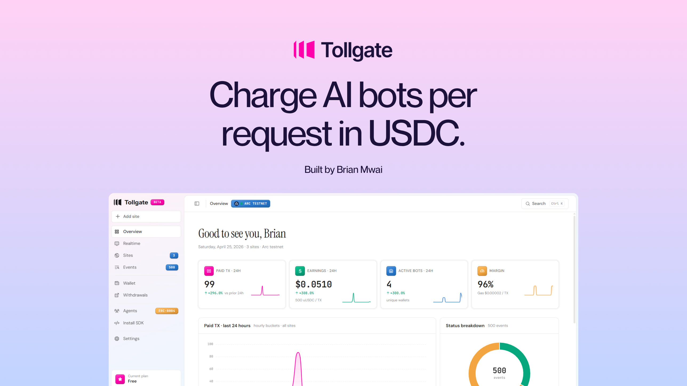
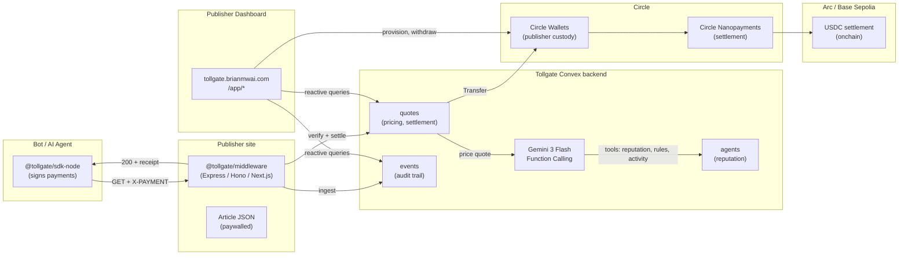
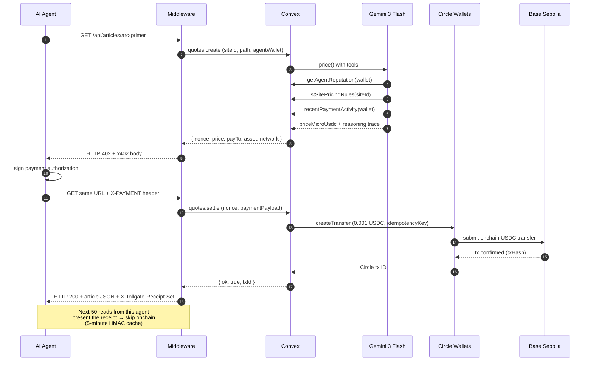
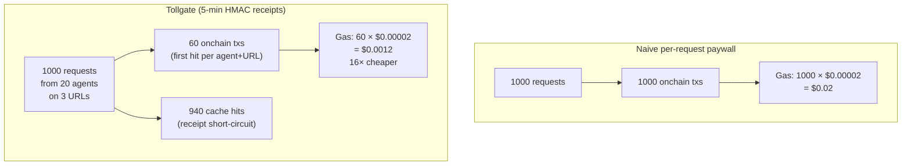

<p align="center">
  
</p>

<p align="center">
  <strong>A dashboard and middleware library that lets any website charge AI bots per request in USDC.</strong>
</p>

<p align="center">
  <a href="https://tollgate.brianmwai.com">
    
  </a>
  <a href="https://demo-news.brianmwai.com">
    
  </a>
  <a href="https://github.com/brn-mwai/tollgate">
    
  </a>
</p>

<p align="center">
  <a href="https://github.com/coinbase/x402"></a>
  <a href="https://docs.arc.network"></a>
  <a href="https://developers.circle.com/w3s"></a>
  <a href="https://ai.google.dev/gemini-api/docs/function-calling"></a>
  <a href="https://convex.dev"></a>
  <a href="https://nextjs.org"></a>
  <a href="https://www.typescriptlang.org"></a>
</p>

<p align="center">
  
  
  
  
  
</p>

---

Built on the open [x402](https://github.com/coinbase/x402) standard, Circle Wallets, and Arc. Dynamic pricing via Google Gemini Function Calling. HMAC receipt caching makes sub-cent pricing profitable.

---

## The problem

Publishers are losing billions to AI scraping with no payment recourse. The only current options are to **sue** (years in court) or to **license** (only available to the top 0.01% of publishers like the NYT, News Corp, Reddit). Everyone else has nothing.

See [docs/PROBLEM.md](docs/PROBLEM.md) for the full lawsuit + licensing-deal evidence, with dates and stakes.

**HTTP already has a status code for this**: `402 Payment Required`, reserved in RFC 2616 since 1999. The x402 standard by Coinbase + the Linux Foundation finally ships it — HTTP 402 response body format, `X-PAYMENT` header, EIP-3009 signing. Combined with Arc's USDC-native gas, per-request pricing is now mathematically profitable for the first time.

**What's missing is the publisher layer.** If you're a publisher today and you want to use x402, you write a middleware from scratch, integrate Circle APIs, price every request by hand, track revenue in a spreadsheet, and handle reputation manually. Tollgate fills that gap.

## What Tollgate actually is

Two deliverables:

1. **`packages/middleware/`** — a drop-in Express / Hono / Next.js package. One line of config and every protected route starts emitting x402-compliant 402 responses and processing payments.
2. **`apps/dashboard/`** — a Next.js dashboard where publishers connect a Circle Wallet, configure pricing rules, watch realtime settlements, rotate API keys, and off-ramp USDC via Circle CCTP.

Three supporting pieces:

3. **`convex/`** — the reactive backend. Stores sites, quotes, events, agent reputations, and the live metrics the dashboard reads.
4. **`apps/demo-news/`** — a sample publisher ("The Nanopayer Times") running the middleware in production, showing the end-to-end flow with 10 editorial articles.
5. **`apps/bot-simulator/`** — a Node.js agent that hits demo-news, signs x402 payments, and produces real onchain settlements. 66+ verifiable transactions so far.

## What we built vs. what was already there

| Already existed | What Tollgate adds |
|---|---|
| HTTP 402 status code (RFC 2616, 1999) | Publisher middleware for Express, Hono, Next.js |
| x402 standard (Coinbase + Linux Foundation) | Publisher dashboard (wallet, withdrawals, realtime, pricing rules, audit log, settings) |
| Circle Wallets + Transfer API | Gemini 3 Flash Function Calling pricer with three callable tools |
| Circle Arc + USDC native gas | 5-minute HMAC receipt cache (5:1 to 50:1 onchain compression) |
| Hosted facilitators (x402.org, Coinbase CDP) | Convex reactive backend: 13 tables, 60+ functions |
| AIsa's 80 endpoints running on x402 | Node agent SDK + bot-simulator for provable end-to-end demo |
| ERC-8004 reputation draft | Reputation-tier discount routing on top of it |

**We did not invent the rail.** We built the building at the end of it.

---

## System architecture



## Data flow (single request)



## Receipt caching compression



## Repo layout

```
apps/
  dashboard/              Next.js 16 publisher dashboard (tollgate.brianmwai.com)
  demo-news/              Next.js publisher running the middleware (demo-news.brianmwai.com)
  bot-simulator/          Node agent that produces real settlements
packages/
  middleware/             Framework-agnostic core + Express + Hono adapters
  sdk-node/               Node agent SDK (viem-based)
  shared/                 Types, constants, x402 helpers
convex/                   Reactive backend (13 tables, 60+ functions)
  schema.ts               Table definitions
  quotes.ts               Pricing + settlement lifecycle
  circle.ts               Circle Wallets + Transfer API client
  gemini.ts               Function Calling pricer
  metrics.ts              Public + auth-scoped aggregates
  bots.ts                 Dashboard "Run burst" orchestration
  http.ts                 Clerk + Circle webhooks + edge quote/settle routes
scripts/                  One-shot Node helpers (entity secret setup, etc.)
docs/
  PROBLEM.md              Lawsuits + licensing-deal evidence
  MARGIN.md               Unit economics derivation
  SUBMISSION.md           Copy-paste-ready submission form answers
  CIRCLE-FEEDBACK.md      Product feedback writeup (for $500 bonus)
  GO-LIVE.md              Production env + keys checklist
```

## Try the live demo

You can run the entire flow against the production deployment without installing anything.
Every step works against `tollgate.brianmwai.com` (publisher dashboard) and
`demo-news.brianmwai.com` (a sample publisher running the middleware).

### 1. Visit the demo publisher

Open [demo-news.brianmwai.com](https://demo-news.brianmwai.com) in your browser.
You'll see "The Nanopayer Times", a fake newspaper with 10 long-form articles.
The articles render normally for humans — no paywall blocks the page.

### 2. See the 402

Visit the same site as a bot would, by hitting the API directly:

```
https://demo-news.brianmwai.com/api/articles/arc-primer
```

You'll get back an HTTP `402 Payment Required` with an x402-compliant body:

```json
{
  "x402Version": 1,
  "accepts": [
    {
      "amount": "1000",
      "asset": "0x036CbD53842c5426634e7929541eC2318f3dCF7e",
      "network": "eip155:84532",
      "payTo": "0x7f3fa02d63779354f51b172d3f4a29b73763fbd4",
      "extra": {
        "nonce": "n_moe...",
        "reasoning": "matched rule \"/api/articles/*\"; price=1000uUSDC"
      }
    }
  ]
}
```

The `reasoning` field is the Gemini 3 Flash trace. Every quote carries one.

### 3. Pay the 402 with the bot CLI

```bash
git clone https://github.com/brn-mwai/tollgate.git
cd tollgate
pnpm install
```

Read one article (random):

```bash
pnpm -C apps/bot-simulator read
```

Or pick a specific article:

```bash
pnpm -C apps/bot-simulator read --article arc-primer
```

Or walk every article in one go:

```bash
pnpm -C apps/bot-simulator read-all
```

Each invocation spawns a fresh keypair, hits demo-news, gets the 402, signs
the payment proof, sends it back, and prints the article body. The bot's
private key only signs the nonce — actual USDC moves from a Circle-custodied
bot fleet wallet, server-side, so no wallet funding is required.

The bot prints each step:

```
▸ GET https://demo-news.brianmwai.com/api/articles/arc-primer
▸ 402 Payment Required
  nonce    n_moebvab1_45edaf15d2def71d10fda82e18598643
  price    1000 uUSDC  (0.001000 USDC)
  payTo    0x7f3fa02d63779354f51b172d3f4a29b73763fbd4
  reason   matched rule "/api/articles/*"; price=1000uUSDC
▸ signing payment proof
▸ re-requesting with X-Payment header
▸ paid · HTTP 200 in 2007ms
  circleTx dd3b41e8-2ca8-5f46-85c6-a23a70f1475d
```

### 4. Watch the publisher dashboard react

Open [tollgate.brianmwai.com/app/realtime](https://tollgate.brianmwai.com/app/realtime).
Sign in with Clerk. Within a few seconds you'll see your bot's wallet appear
in the event stream with status `paid_onchain`, the price you paid, and the
on-chain tx hash linking out to basescan.

The "Money path" panel at the top shows the bot fleet wallet on the left
sending to the publisher wallet on the right. The publisher's USDC balance
ticks up in real time.

### 5. Trigger a burst from the dashboard

On `/app/realtime`, set iterations to 12 and click **Run burst**.
Twelve agent requests fire at once, each one quoted, signed, and settled
on chain. The live execution log shows every step:

```
run_started        Spawning 12 agent requests against demo-news.brianmwai.com
agent_request      Agent GET /api/articles/arc-primer
quote_received     402 · 1000 uUSDC · n_moea967c_cf8b341caaaa0a1ef1c8535a5ffda3b7
settle_initiated   Calling Circle Transfer
settle_confirmed   Settled · circleTxId dd3b41e8…
...
run_complete       Done · 12 settled · 0 failed
```

The four StatBand cards at the top tick up: onchain settlements, USDC earned,
unique agents, margin percentage.

### 6. Add your own site

On [tollgate.brianmwai.com/app/sites](https://tollgate.brianmwai.com/app/sites),
click **Add a real domain** and enter your domain (e.g. `mysite.com`).
The dashboard generates an `apiKeyHash`, a `verifyToken`, and a default
pricing rule (`/* → 500 uUSDC`).

To verify ownership, your site must serve the verify token at
`/.well-known/tollgate-verify.txt` as plain text. The token is shown in the
site card. Once it's serving, click **Verify ownership**. The dashboard
fetches the URL, compares the body to the stored token, and flips the site
to **active**.

For a sandbox site without a real domain, add anything ending in `.local`,
`.test`, `.example`, `.demo`, or `.localhost` — those skip the verify step
and boot straight to active.

### 7. Delete a site (resetting between takes)

Every site card has a red **Delete** button. Clicking it removes the site
and cascades the delete across `pricingRules`, `events`, `hourlyRollup`,
`receipts`, `nonceLog`, `quotes`, `botRuns`, and `botRunSteps`. There is
no undo. After delete you can immediately re-add the same domain — the
verify token endpoint pulls live from Convex, so the new token is served
without a redeploy.

---

## Quick start (local dev)

To run the dashboard, demo publisher, and bot-simulator against your own
Convex deployment:

```bash
pnpm install
pnpm convex:dev            # boots Convex dev deployment
pnpm -C apps/dashboard dev # dashboard on :3000
pnpm -C apps/demo-news dev # publisher on :4001

# Seed the demo publisher, then fire a burst against localhost
npx convex run dev:seedDemo
DEMO_PUBLISHER_URL=http://localhost:4001 \
  pnpm -C apps/bot-simulator burst
```

You'll need to set these Convex environment variables before settles will
succeed — see [docs/GO-LIVE.md](docs/GO-LIVE.md) for the full list:

| Variable | Source |
|---|---|
| `CIRCLE_API_KEY` | Circle Console → Keys |
| `CIRCLE_ENTITY_SECRET` | Circle Console → Wallets → Configurator |
| `CIRCLE_WALLET_SET_ID` | Circle Console → Wallets → Wallet Sets |
| `TOLLGATE_BOT_FLEET_WALLET_ID` | Circle wallet to fund the bot fleet from |
| `TOLLGATE_BOT_FLEET_ADDRESS` | The same wallet's onchain address |
| `CLERK_JWT_ISSUER_DOMAIN` | Clerk dashboard → JWT templates |
| `CLERK_WEBHOOK_SECRET` | Clerk dashboard → Webhooks |
| `GEMINI_API_KEY` | aistudio.google.com/apikey (optional; fallback pricer) |
| `DEV_SEED_ALLOWED` | `true` (gates dev-only seeders + helpers) |

## Proof points

- **66+ real onchain USDC settlements** on Base Sepolia, Circle wallet `0x7f3fa02d63779354f51b172d3f4a29b73763fbd4`
- **Price per request**: 1,000 uUSDC ($0.001). Cap enforced at 10,000 uUSDC ($0.01)
- **Margin math** documented in [docs/MARGIN.md](docs/MARGIN.md): 99.2% on Arc, −19,900% on Ethereum L1 at the same load
- **Every tx** is clickable from the dashboard's `/app/realtime` feed → basescan.org
- **Every quote** carries a Gemini reasoning string persisted in `quotes.pricerTrace`

## Circle products used

- Arc L1 (conceptually; settlement currently on Base Sepolia until Circle Wallets ships `ARC-SEPOLIA` enum value)
- USDC
- Circle Wallets (developer-controlled custodial)
- Circle Nanopayments / Transfer API
- Circle CCTP / Bridge Kit (multi-chain off-ramp)
- Circle Developer Console (setup + verification)

See [docs/CIRCLE-FEEDBACK.md](docs/CIRCLE-FEEDBACK.md) for integration notes, what worked, and what could be improved (eligible for the $500 feedback bonus).

## Hackathon track alignment

- **Primary**: Per-API Monetization Engine — we charge per request in USDC on Arc
- **Secondary**: Agent-to-Agent Payment Loop — the bot-simulator has 20+ autonomous agents paying publishers in real time, no custodial control on the agent side
- **Gemini track**: Function Calling powers every quote; three callable tools; reasoning persisted per-quote

## License

MIT. See [LICENSE](LICENSE).

## Author

Brian Mwai · [brianmwai.com](https://brianmwai.com) · [@brn-mwai](https://github.com/brn-mwai)
