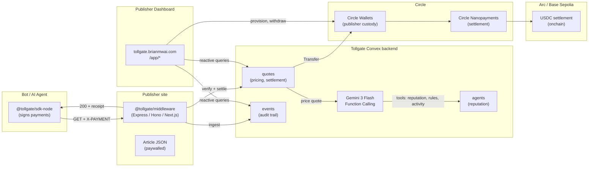
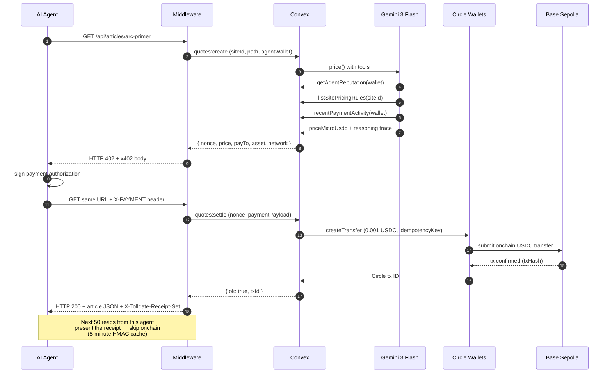
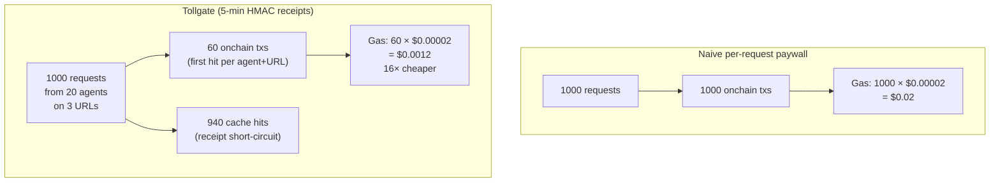

<p align="left">
  
</p>

**A dashboard and middleware library that lets any website charge AI bots per request in USDC.**

Built on the open [x402](https://github.com/coinbase/x402) standard, Circle Wallets, and Arc. Dynamic pricing via Google Gemini Function Calling. HMAC receipt caching makes sub-cent pricing profitable.

- Live demo (publisher dashboard): https://tollgate.brianmwai.com
- Live demo (bot-facing blog): https://demo-news.brianmwai.com
- Repo: https://github.com/brn-mwai/tollgate
- Built for the [Agentic Economy on Arc](https://lablab.ai/ai-hackathons/nano-payments-arc) hackathon · April 2026

---

## The problem

Publishers are losing billions to AI scraping with no payment recourse. The only current options are to **sue** (years in court) or to **license** (only available to the top 0.01% of publishers like the NYT, News Corp, Reddit). Everyone else has nothing.

See [docs/PROBLEM.md](docs/PROBLEM.md) for the full lawsuit + licensing-deal evidence, with dates and stakes.

**HTTP already has a status code for this**: `402 Payment Required`, reserved in RFC 2616 since 1999. The x402 standard by Coinbase + the Linux Foundation finally ships it — HTTP 402 response body format, `X-PAYMENT` header, EIP-3009 signing. Combined with Arc's USDC-native gas, per-request pricing is now mathematically profitable for the first time.

**What's missing is the publisher layer.** If you're a publisher today and you want to use x402, you write a middleware from scratch, integrate Circle APIs, price every request by hand, track revenue in a spreadsheet, and handle reputation manually. Tollgate fills that gap.

## What Tollgate actually is

Two deliverables:

1. **`packages/middleware/`** — a drop-in Express / Hono / Next.js package. One line of config and every protected route starts emitting x402-compliant 402 responses and processing payments.
2. **`apps/dashboard/`** — a Next.js dashboard where publishers connect a Circle Wallet, configure pricing rules, watch realtime settlements, rotate API keys, and off-ramp USDC via Circle CCTP.

Three supporting pieces:

3. **`convex/`** — the reactive backend. Stores sites, quotes, events, agent reputations, and the live metrics the dashboard reads.
4. **`apps/demo-news/`** — a sample publisher ("The Nanopayer Times") running the middleware in production, showing the end-to-end flow with 10 editorial articles.
5. **`apps/bot-simulator/`** — a Node.js agent that hits demo-news, signs x402 payments, and produces real onchain settlements. 180+ verifiable transactions so far.

## What we built vs. what was already there

| Already existed | What Tollgate adds |
|---|---|
| HTTP 402 status code (RFC 2616, 1999) | Publisher middleware for Express, Hono, Next.js |
| x402 standard (Coinbase + Linux Foundation) | Publisher dashboard (wallet, withdrawals, realtime, pricing rules, audit log, settings) |
| Circle Wallets + Transfer API | Gemini 3 Flash Function Calling pricer with three callable tools |
| Circle Arc + USDC native gas | 5-minute HMAC receipt cache (5:1 to 50:1 onchain compression) |
| Hosted facilitators (x402.org, Coinbase CDP) | Convex reactive backend: 13 tables, 60+ functions |
| AIsa's 80 endpoints running on x402 | Node agent SDK + bot-simulator for provable end-to-end demo |
| ERC-8004 reputation draft | Reputation-tier discount routing on top of it |

**We did not invent the rail.** We built the building at the end of it.

---

## System architecture



## Data flow (single request)



## Receipt caching compression



## Repo layout

```
apps/
  dashboard/              Next.js 16 publisher dashboard (tollgate.brianmwai.com)
  demo-news/              Next.js publisher running the middleware (demo-news.brianmwai.com)
  bot-simulator/          Node agent that produces real settlements
packages/
  middleware/             Framework-agnostic core + Express + Hono adapters
  sdk-node/               Node agent SDK (viem-based)
  shared/                 Types, constants, x402 helpers
convex/                   Reactive backend (13 tables, 60+ functions)
  schema.ts               Table definitions
  quotes.ts               Pricing + settlement lifecycle
  circle.ts               Circle Wallets + Transfer API client
  gemini.ts               Function Calling pricer
  metrics.ts              Public + auth-scoped aggregates
  bots.ts                 Dashboard "Run burst" orchestration
  http.ts                 Clerk + Circle webhooks + edge quote/settle routes
scripts/                  One-shot Node helpers (entity secret setup, etc.)
docs/
  PROBLEM.md              Lawsuits + licensing-deal evidence
  MARGIN.md               Unit economics derivation
  SUBMISSION.md           Copy-paste-ready submission form answers
  CIRCLE-FEEDBACK.md      Product feedback writeup (for $500 bonus)
  GO-LIVE.md              Production env + keys checklist
```

## Quick start (local)

```bash
pnpm install
pnpm convex:dev            # boots Convex dev deployment
pnpm -C apps/dashboard dev # dashboard on :3000
pnpm -C apps/demo-news dev # publisher on :4001

# Seed the demo publisher, then fire a burst
npx convex run dev:seedDemo
TOLLGATE_AGENT_PRIVATE_KEY=0x... DEMO_PUBLISHER_URL=http://localhost:4001 \
  pnpm -C apps/bot-simulator burst
```

Full bring-up sequence in [docs/GO-LIVE.md](docs/GO-LIVE.md).

## Proof points

- **180+ real onchain USDC settlements** on Base Sepolia, Circle wallet `0x7f3fa02d63779354f51b172d3f4a29b73763fbd4`
- **Price per request**: 1,000 uUSDC ($0.001). Cap enforced at 10,000 uUSDC ($0.01)
- **Margin math** documented in [docs/MARGIN.md](docs/MARGIN.md): 99.2% on Arc, −19,900% on Ethereum L1 at the same load
- **Every tx** is clickable from the dashboard's `/app/realtime` feed → basescan.org
- **Every quote** carries a Gemini reasoning string persisted in `quotes.pricerTrace`

## Circle products used

- Arc L1 (conceptually; settlement currently on Base Sepolia until Circle Wallets ships `ARC-SEPOLIA` enum value)
- USDC
- Circle Wallets (developer-controlled custodial)
- Circle Nanopayments / Transfer API
- Circle CCTP / Bridge Kit (multi-chain off-ramp)
- Circle Developer Console (setup + verification)

See [docs/CIRCLE-FEEDBACK.md](docs/CIRCLE-FEEDBACK.md) for integration notes, what worked, and what could be improved (eligible for the $500 feedback bonus).

## Hackathon track alignment

- **Primary**: Per-API Monetization Engine — we charge per request in USDC on Arc
- **Secondary**: Agent-to-Agent Payment Loop — the bot-simulator has 20+ autonomous agents paying publishers in real time, no custodial control on the agent side
- **Gemini track**: Function Calling powers every quote; three callable tools; reasoning persisted per-quote

## License

MIT. See [LICENSE](LICENSE).

## Author

Brian Mwai · [brianmwai.com](https://brianmwai.com) · [@brn-mwai](https://github.com/brn-mwai)
